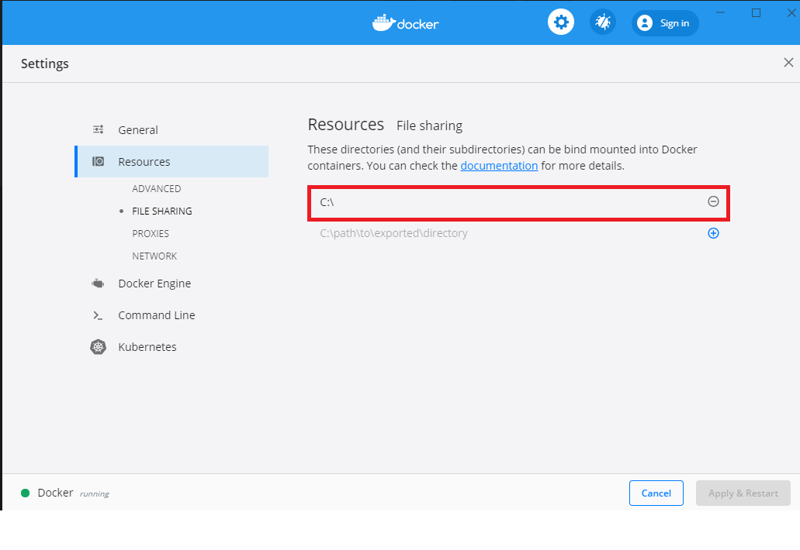

## Backend - Setup Guidelines
This project running on Laravel 8.x, using docker as the development
environment setup.

> In order to get the very same environment local as production, and amongst the developers, we use docker to emulate the prod server environment!

You can learn more about docker and its possibilities at: [Docker.com](https://store.docker.com/search?type=edition&offering=community)

**Note**
The project setup uses an decoupled front-end solution. In order to setup the front-end,
visit the frontend repository.

## Requirements for setup

- [Docker](https://store.docker.com/search?type=edition&offering=community)
- [Docker Compose](https://docs.docker.com/compose/install/) (Usually included with Docker)
- Any bash terminal. _(Builtin for OSX/Linux)_
- [NPM](https://www.npmjs.com/)
- [NodeJS](https://nodejs.org/en/) (Usually Included with npm)

---

## Getting started

### Containers
Development on this project uses Docker. [Read more about Docker](https://www.docker.com/).

**To start containers**, simply run:

`$ docker-compose up -d`

The `-d` flag will run the containers as a daemon in the background.

**To stop**:

`$ docker-compose stop`

Stopping can be likened to putting the containers to sleep.

_Tip: Alias `docker-compose` to something shorter, like `dc` and `ds`._

## Composer
Dependencies are managed through composer. Since we run the project in Docker containers, 
we need to run composer inside the containers. For convenience we have created a little 
script to help with this:

`$ ./dev.sh composer install`

### Windows devs
If you are on Windows, you need to set bash as the default terminal in order to 
correctly execute the dev script. 

> **Tip**: Create an alias for `dev.sh` in bashrc!

## Artisan
Artisan is a CLI tool to help with common Laravel tasks. This has to be run inside 
the Docker container as well, so again for convenience we have created a script for that:

`$ ./dev.sh artisan`

---

## Initial Setup
To install neccesary development tools and first instance of website, run the
suitable commands:

> docker-compose build && docker-compose up -d && ./dev.sh composer install

**Note**: 
If you are on windows, you need to add the C:\\ drive to the resource settings 
in docker. See _FAQ_ at the bottom of the readme for instructions.

On your very first setup, you need to generate an application key. Luckily, there's help for that.

> ./dev.sh artisan key:generate

This project uses Laravel passport for API tokens during authentication.

> ./dev.sh artisan passport:install

You can now visit the project at http://localhost/ .

### Additional

There's also a dev script to reset your database, which wipes it in before hand.
> ./dev.sh resetdb

It will: 

* Flush database
* Create tables
* Generate passport keys

---

## FAQ

### How do I connect to the database?
Using any database GUI software, use the following credentials in order to connect to
the local database in your environment that's set up from docker.

* Host: 0.0.0.0 (or localhost)
* User: laravel
* Password: laravel
* Database: laravel

### Is the production also within a container?
Due to (docker being a performance issue)[https://docs.docker.com/config/containers/runmetrics/], 
we only use it for our local environments.

### How do I enter the container?
The dev.sh script has the answer!

`./dev.sh bash`

alternatively, enter as root

`./dev.sh root`

### I got permission issues?
Depending on OS, it can give these mysterious problems for some.

Fix it by:

`./dev.sh root`

`$ chown -R www-data:www-data /var/www`

### Windows: "Filesharing has been cancelled"

Add the C:\\ drive to the resource settings in docker.

### On Windows, can I set an alias for the dev script?

Of course! Using bash, you can simply create an `.bashrc` file with your aliases
within. Some good aliases would be `d` for `dev.sh` and `dc` for `docker-compose`.
